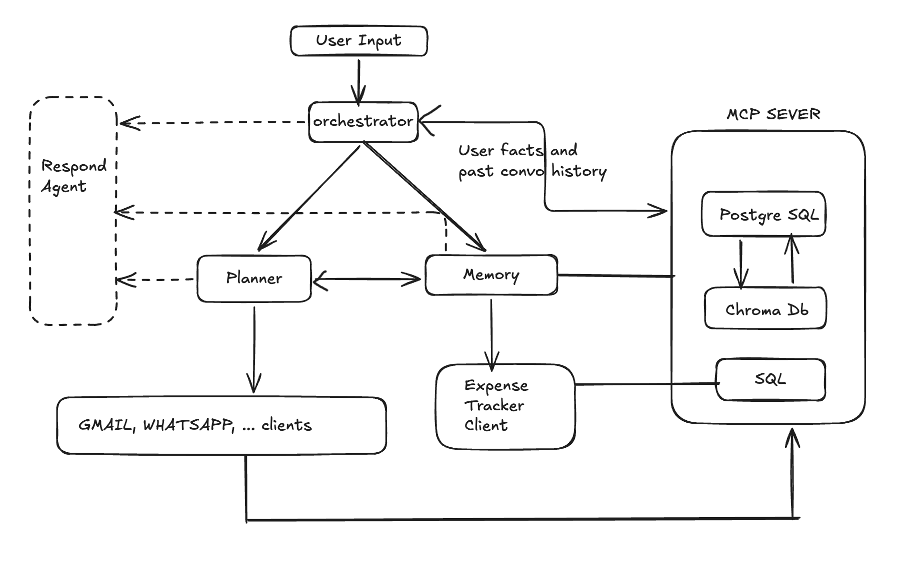

# Deep Thought

Deep Thought is a local-first personal assistant built with FastAPI, LangGraph,
OpenAI models and Model Context Protocol (MCP) tools. It combines a web chat UI
with durable memory, tasks, reminders, expense tracking, Gmail, Google Calendar
and WhatsApp.

> Status: active development. The current application is designed primarily
> for one local user. Review the [security notes](SECURITY.md) before exposing
> it beyond localhost.



## Capabilities

| Area | What it supports |
| --- | --- |
| Tasks | Create, list, update, complete, reschedule and track task status |
| Reminders | Durable reminders, popup/sound notifications and acknowledgement |
| WhatsApp | QR linking, send/receive, contact disambiguation, replies and backlog grouping |
| Gmail | Read, search, draft, send, reply, archive and scheduled delivery |
| Calendar | Create/list/cancel events, Google Meet links and attendee invitations |
| Expenses | INR expenses, search, editing, reports, budgets, charts and undo |
| Gmail expense imports | Conservative Indian-bank debit detection with user review and categorization |
| Memory | PostgreSQL source of truth, Chroma semantic lookup, working context and action history |
| Daily briefing | Once-per-morning summary of due work, reminders and pending items |
| UI | Dark/light themes, notification center, task panel, Gmail reader and responsive layout |

## How it works

```text
Browser / natural-language request
              |
          FastAPI API
              |
     LangGraph orchestrator
       /        |         \
  memory     planner     respond
     |           |
 PostgreSQL   MCP clients
 + Chroma        |
            MCP tool servers
     (tasks, reminders, Gmail, Calendar,
         WhatsApp and expense tracker)
```

- The **orchestrator** classifies intent and selects an agent.
- The **planner** executes action-oriented integrations.
- The **memory agent** handles long-term memory and expense requests.
- The **response agent** formats grounded agent/tool results.
- MCP keeps external integrations separate from agent reasoning.

See [docs/README.md](docs/README.md) for focused design and integration guides.

## Repository layout

```text
Agent_Definations/       LangGraph agent nodes and prompts
Server/                  Memory MCP server and PostgreSQL/Chroma adapters
api/                     FastAPI routes
mcp_servers/
  calendar/              Google Calendar MCP server/client
  expense/               SQLite expense tracker MCP server/client
  gmail/                 Gmail MCP server/client and scheduled-email store
  reminder/              PostgreSQL reminder MCP server/client
  tasks/                 PostgreSQL tasks MCP server/client
  whatsappmeow/          Go/whatsmeow MCP server and QR pairing helper
static/                  Browser JavaScript and CSS
templates/               Main HTML application
docs/                    Setup, architecture and feature documentation
tests/                   Focused automated assertions
graph.py                 LangGraph workflow
main.py                  FastAPI application and service lifecycle
```

## Requirements

- Python 3.11 or newer (3.12 is used during development)
- PostgreSQL 14 or newer
- Go 1.22 or newer for WhatsApp
- An OpenAI API key
- A Google Cloud Desktop OAuth client for Gmail/Calendar (optional)
- A WhatsApp account capable of linking a device (optional)

## Quick start

### 1. Clone and create a virtual environment

```bash
git clone https://github.com/YOUR_USERNAME/deep-thought.git
cd deep-thought
python3 -m venv .venv
source .venv/bin/activate
python -m pip install --upgrade pip
python -m pip install -r requirements.txt
```

Windows PowerShell activation:

```powershell
.venv\Scripts\Activate.ps1
```

### 2. Configure the environment

```bash
cp .env.example .env
```

Edit `.env` and provide at least `OPENAI_API_KEY` and your PostgreSQL
credentials. Never commit `.env`, OAuth JSON, tokens or local databases.

### 3. Run the setup assistant

After editing `.env`, run:

```bash
python scripts/setup.py
```

The command:

- validates Python and installed runtime packages;
- verifies `.env` and `OPENAI_API_KEY`;
- checks Go for the optional WhatsApp integration;
- connects to PostgreSQL and creates the configured database when the role has
  permission;
- applies the core schema and initializes all application PostgreSQL tables;
- creates local Chroma, credential and SQLite directories;
- initializes expense and Gmail-expense-import tables.

It is safe to run repeatedly. Existing databases and tables are preserved.

Useful options:

```bash
python scripts/setup.py --check-only
python scripts/setup.py --no-create-database
python scripts/setup.py --skip-database
```

If the configured PostgreSQL role cannot create databases, use a privileged
role once and rerun setup:

```bash
createdb ai_assistant_memory
python scripts/setup.py --no-create-database
```

Manual schema fallback:

```bash
psql -d ai_assistant_memory -f docs/postgres-schema.sql
```

### 4. Start the application

```bash
uvicorn main:app --reload
```

Open [http://127.0.0.1:8000](http://127.0.0.1:8000).

The FastAPI lifecycle starts the MCP clients; you do not normally start every
MCP server manually.

## Environment variables

| Variable | Required | Default | Purpose |
| --- | --- | --- | --- |
| `OPENAI_API_KEY` | Yes | — | Agent and MCP-client model calls |
| `POSTGRES_HOST` | Yes* | `localhost` | PostgreSQL host |
| `POSTGRES_PORT` | No | `5432` | PostgreSQL port |
| `POSTGRES_DB` | No | `ai_assistant_memory` | PostgreSQL database |
| `POSTGRES_USER` | Yes* | `postgres` | PostgreSQL user |
| `POSTGRES_PASSWORD` | Usually | empty | PostgreSQL password |
| `APP_TIMEZONE` | No | `Asia/Kolkata` | Reminders, tasks, Gmail and Calendar timezone |
| `GMAIL_FROM_EMAIL` | No | authenticated account | Optional explicit From address; it must belong to the authenticated account |
| `GOOGLE_CALENDAR_ID` | No | `primary` | Calendar used by the Calendar MCP server |
| `DEEP_THOUGHT_CREDENTIALS_DIR` | No | `~/.deep-thought/credentials` | Local Google OAuth configuration/token fallback |
| `EXPENSE_DB_PATH` | No | expense server directory | SQLite expense database |
| `CHROMA_PATH` | No | `Databases/Chroma` | Local semantic-memory store |
| `WHATSMEOW_SESSION_DB` | No | WhatsApp server directory | WhatsApp linked-device session |
| `WHATSMEOW_LOG_DB` | No | WhatsApp server directory | WhatsApp message log |
| `WORKING_CONTEXT_TTL_MINUTES` | No | `360` | Short-term tool-context lifetime |
| `DEEP_THOUGHT_DEBUG` | No | `1` | Structured terminal diagnostics (`0` disables) |

`*` Local peer authentication may not require explicit credentials.

## Google Gmail and Calendar setup

Each open-source user supplies their own Google Cloud OAuth project:

1. Create a Google Cloud project.
2. Enable Gmail API and Google Calendar API.
3. Configure an External OAuth consent screen. While in Testing, add your
   Google account as a test user.
4. Create a **Desktop app** OAuth client and download its JSON.
5. In Deep Thought, open **Settings**, select **Add OAuth JSON**, then connect.

Gmail and Calendar share one local authorization. Tokens are stored in the OS
keyring when possible, with a permission-restricted local fallback. See
[Google OAuth setup](docs/google-oauth.md).

## WhatsApp setup

1. Install Go and ensure `go version` works.
2. Start Deep Thought and open **Settings**.
3. Select **Connect** beside WhatsApp.
4. On the phone, open **WhatsApp → Settings → Linked devices → Link a device**.
5. Scan the displayed QR code.

The linked session remains local and is reused across restarts. The Settings
toggle only stops sending and receiving; **Disconnect** securely unlinks the
device and removes its local authentication session, so a new QR scan is
required to reconnect. See [WhatsApp pairing](docs/whatsapp-pairing.md).

## Gmail expense imports

When Google is connected, the app checks recent Gmail messages for confirmed
Indian-bank debit alerts. Imports are deduplicated by Gmail message ID and
appear in the notification center with **Keep**, **Delete** and category
controls. Categories are never hard-coded or applied automatically; optional
suggestions come only from the user's previously confirmed category for the
same merchant.

OTP, refund, reversal, credit, failed and ambiguous transaction emails are
ignored. See [Gmail transaction imports](docs/gmail-expense-imports.md).

## Example requests

```text
Remind me to send the report in 30 minutes.
Create a high-priority task to review the launch checklist tomorrow.
Send “I will call you shortly” to Pp on WhatsApp.
Show my unread Gmail messages.
Schedule an email to person@example.com tomorrow at 9 AM.
Schedule a 30-minute product meeting tomorrow at 2 PM with person@example.com.
Add ₹450 spent on food today.
Show my monthly spending by category.
What do I have due today?
```

## Debugging

Structured logs are emitted to stderr, which keeps MCP stdout JSON-RPC safe:

```text
[DEBUG][AGENT] ... route ...
[DEBUG][TOOL] ... call ...
[DEBUG][DB] ... query ...
[DEBUG][API] ... response ...
```

Sensitive tokens, passwords, prompts and message bodies are masked. See
[debug logging](docs/debug-logging.md).

FastAPI's interactive endpoint reference is available at
[http://127.0.0.1:8000/docs](http://127.0.0.1:8000/docs) while the application
is running.

## Troubleshooting

### PostgreSQL connection fails

Confirm PostgreSQL is running and that `POSTGRES_HOST`, `POSTGRES_PORT`,
`POSTGRES_DB`, `POSTGRES_USER` and `POSTGRES_PASSWORD` match a working `psql`
connection. Apply `docs/postgres-schema.sql` to the configured database.
You can also rerun `python scripts/setup.py` for a consolidated diagnostic.

### Google says the app is not available

While the OAuth consent screen is in Testing, add the signing-in account as a
test user. Confirm both Gmail API and Google Calendar API are enabled and that
the uploaded JSON is a **Desktop app** OAuth client.

### WhatsApp QR does not appear

Run `go version`, confirm the machine can reach WhatsApp, and inspect
`[DEBUG][TOOL]` service-start logs. Remove a linked device from the phone only
when intentionally pairing again; do not delete session databases casually.

### An MCP process reports `BrokenPipeError`

A broken pipe commonly means the parent app stopped or restarted while a child
MCP process was writing a response. Restart FastAPI and inspect the earlier
terminal lines for the original tool/startup error.

### An integration is unavailable

The core UI can start while an optional MCP integration fails. Check the
Settings connection state and terminal debug logs, then verify that integration's
runtime, credentials and network access.

## Testing

Run syntax and focused parser checks:

```bash
python -m pip install -r requirements-dev.txt
python -m py_compile main.py api/routes.py graph.py
python -m pytest -q
```

Some external integration tests require PostgreSQL, Google OAuth, network
access or a linked WhatsApp account. Do not run them against production data.

## Security and privacy

- Run the development server on localhost; the current UI/API is not hardened
  for public internet exposure.
- Use a dedicated PostgreSQL role with access only to this database.
- OAuth credentials, refresh tokens, WhatsApp sessions and local SQLite files
  must remain untracked.
- Review Gmail and Calendar OAuth scopes before authorization.
- Back up local data before changing integrations or schemas.
- Report vulnerabilities according to [SECURITY.md](SECURITY.md).

## Contributing

Bug fixes, integrations, parser samples and documentation improvements are
welcome. Read [CONTRIBUTING.md](CONTRIBUTING.md) before opening a pull request.

## Acknowledgements

Deep Thought uses or adapts work from these open-source projects:

- [tulir/whatsmeow](https://github.com/tulir/whatsmeow) — the Go WhatsApp
  client foundation used by the WhatsApp MCP integration.
- [GenAIwithMS/Expense-tracker-MCP](https://github.com/GenAIwithMS/Expense-tracker-MCP)
  — the foundation used for the Expense Tracker MCP integration.

Thank you to their maintainers and contributors. Their respective upstream
licenses and attribution requirements continue to apply to reused or adapted
components; review and preserve the relevant license notices when distributing
this project.

## License

Deep Thought's original source code is available under the [MIT License](LICENSE).
Bundled or adapted third-party components retain their own licenses; see
[Third-party notices](THIRD_PARTY_NOTICES.md).
